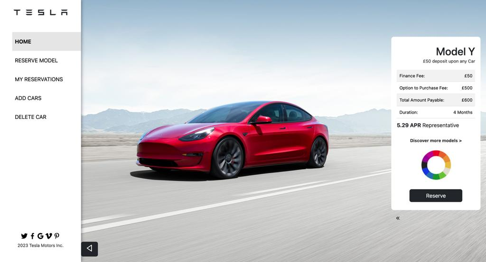
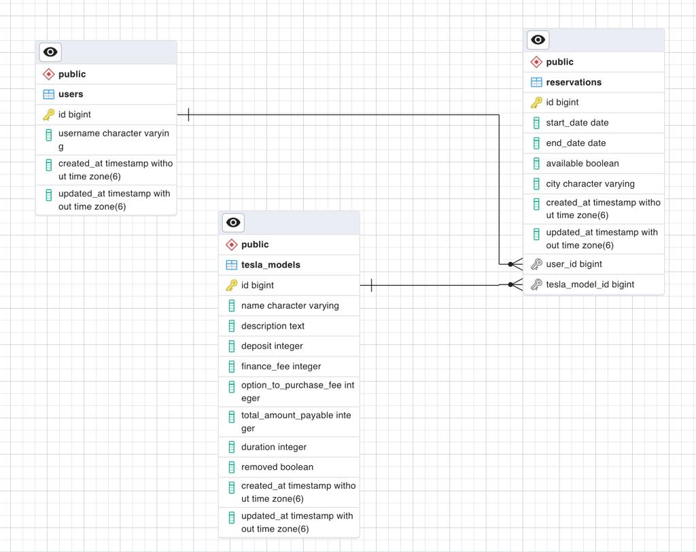

<div align="center">



<a name="readme-top"></a>

  <h1><b>Tesla Test Drive</b></h1>

</div>

# 📗 Table of Contents

- [📗 Table of Contents](#-table-of-contents)
- [📖 Final Capstone Front End ](#-final-capstone-front-end-)
    - [🛠 ER Diagram ](#-er-diagram-)
    - [💻 Link to Demo ](#-link-to-demo-)
    - [💻 Link to Back End ](#-link-to-back-end-)
    - [💻 link to Kanban board information ](#-link-to-kanban-board-information-)
    - [🛠 Built With ](#-built-with-)
        - [Tech Stack ](#tech-stack-)
        - [Key Features ](#key-features-)
    - [💻 Getting Started ](#-getting-started-)
        - [Prerequisites](#prerequisites)
        - [Setup](#setup)
        - [Install](#install)
        - [Usage](#usage)
        - [Run tests](#run-tests)
    - [👥 Authors ](#-authors-)
    - [🔭 Future Features ](#-future-features-)
    - [🤝 Contributing ](#-contributing-)
    - [⭐️ Show your support ](#️-show-your-support-)
    - [🙏 Acknowledgments ](#-acknowledgments-)
    - [❓ FAQ (OPTIONAL) ](#-faq-optional-)
    - [📝 License ](#-license-)
# 📖 Tesla Test Drive Front End <a name="about-project"></a>

**Tesla Test Drive Front End** The front-end component of this final capstone project is developed using React.js, designed to provide an intuitive user interface for managing reservations or appointments for test drives of teslas. It communicates with the back-end API built with Ruby on Rails.

## 🛠 ER Diagram <a name="er-diagram"></a>



<p align="right"\><a href="#readme-top"\>back to top</a></p>

## 💻 Link to Demo <a name="link-to-demo"></a>

[Link to Demo]()

## 💻 Link to Back End <a name="link-to-back-end"></a>

[Link to Back End API](https://github.com/flemton/Final-Capstone-Backend)

<p align="right"\><a href="#readme-top"\>back to top</a></p>

## 💻 link to Kanban board <a name="built-with"></a>

[Link to Kanban Board](https://github.com/users/flemton/projects/3)

This project was completed by three Team members:

- Alhassan Osman
- Sergio Andres Usma
- Gueleu Farida

<p align="right"><a href="#readme-top">back to top</a></p>

## 🛠 Built With <a name="built-with"></a>

### Tech Stack <a name="tech-stack"></a>

<details>
  <summary>Technologies</summary>
  <ul>
    <li><a href="https://reactjs.org/">React.js</a></li>
  </ul>
</details>

### Key Features <a name="key-features"></a>

- [x] **API communication with Backend**
- [x] **Login and Register users**
- [x] **Responsive Design**
- [x] **Create and modify Teslas and reservations**

<p align="right"\><a href="#readme-top"\>back to top</a></p>

## 💻 Getting Started <a name="getting-started"></a>

To get a local copy up and running, follow these steps.

### Prerequisites

Before you begin, make sure you have the following prerequisites installed on your system:

- Node.js: You need Node.js to run the React.js application.
- npm: npm is used to manage packages in your React project.

### Setup

Clone this repository to your desired folder:

sh <br>
cd my-folder <br>
git clone https://github.com/flemton/Final-Capstone-Frontend.git

### Install

Install this project with:

- npm install

### Usage

To run the project, execute the following command:

npm start

### Run tests <a name="tests"></a>
To run the frontend tests, follow these steps:

### Prerequisites

Before running the tests, ensure you have the following installed:

- Node.js: You need Node.js to execute the test scripts.
- npm: npm is used to manage packages in your React project.

### Running Tests

Execute the following command to run the tests:

```bash
npm test
```
This command will run the test suites and provide you with the test results and coverage information.


<p align="right"><a href="#readme-top">back to top</a></p>

## 👥 Authors <a name="authors"></a>

👤 **Alhassan (Newton) Osman**

- GitHub: [@flemton](https://github.com/flemton)
- LinkedIn: [@newtongh](https://www.linkedin.com/in/newtongh/)

👤 **Gueleu Farida**

- GitHub: [@SFarida](https://github.com/SFarida)
- LinkedIn: [Gueleu Farida](https://www.linkedin.com/in/SFarida/)

👤 **Sergio Andres Usma**

- GitHub: [@sergio-usma](https://github.com/sergio-usma)
- LinkedIn: [sergio-usma](https://www.linkedin.com/in/sergio-usma/)

<p align="right"\><a href="#readme-top"\>back to top</a></p>

## 🔭 Future Features <a name="future-features"></a>

- [ ] **User Authentication and Authorization**
- [ ] **Integration with External calendars for reminders**
- [ ] **User Profile Management**

<p align="right"\><a href="#readme-top"\>back to top</a></p>

## 🤝 Contributing <a name="contributing"></a>

Contributions, issues, and feature requests are welcome!

Feel free to check the [issues page](https://github.com/flemton/Final-Capstone-Frontend/issues).

<p align="right"\><a href="#readme-top"\>back to top</a></p>

## ⭐️ Show your support <a name="support"></a>

If you find this project helpful, feel free to contribute or give it a star. Your support is appreciated!

<p align="right"\><a href="#readme-top"\>back to top</a></p>

## 🙏 Acknowledgments <a name="acknowledgments"></a>

- We would like to thank Murat Korkmaz for the [original design](https://www.behance.net/gallery/26425031/Vespa-Responsive-Redesign) and Microverse for providing the opportunity to learn and implement this in a group, this helped us overcome so many challenges and also helped us grow.

<p align="right"\><a href="#readme-top"\>back to top</a></p>

## ❓ FAQ (OPTIONAL) <a name="faq"></a>

- **Can I use your project as a template for my own project?**

    - Certainly, feel free to use this project as a template for your own work.

- **Is your project licensed?**

    - Yes, this project is open-source and available under the MIT License. You can find more details about the license [here](MIT.md).

<p align="right"\><a href="#readme-top"\>back to top</a></p>

## 📝 License <a name="license"></a>

This project is [MIT](./LICENSE) licensed.

<p align="right"\><a href="#readme-top"\>back to top</a></p>